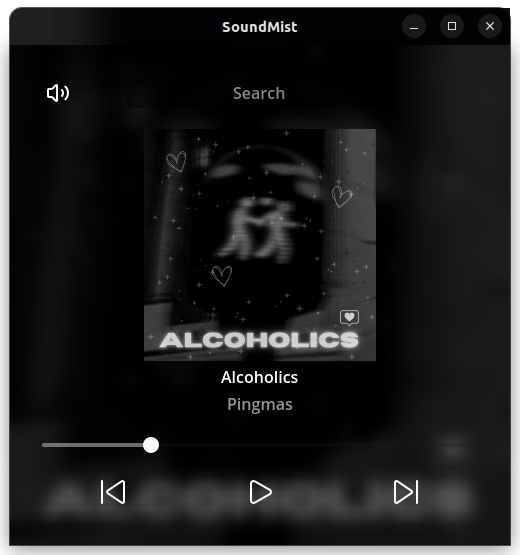

# SoundMist 🎵

*A lightweight Godot/C# music player powered by SoundCloud's internal API.*

## Overview

**SoundMist** is a custom-built music streaming application created with **Godot Engine (C#)**.
It connects to SoundCloud’s **undocumented internal API (api-v2)**.

The app focuses on simplicity:

- Search for music by **track name**.
- Fetch the corresponding **station** (a curated playlist of related tracks).
- Enjoy continuous playback of similar songs, based on what SoundCloud users who liked the track also enjoy.

Unlike typical SoundCloud integrations, **no manual `client_id` setup is needed** — SoundMist automatically retrieves it behind the scenes.

## Showcase 📸

### Screenshots





### Demo Video


## Features

- 🔍 **Search by song name**
- 🎶 **Station-based playback** (auto-generated playlists with similar tracks)
- ⚡ **Automatic `client_id` resolution** (no need for manual credentials)
- 🖥️ Built in **Godot Engine with C#**, providing a smooth and efficient desktop experience

## Limitations

Since the app relies on **SoundCloud's internal API**:

- Only **track searching** and **station fetching** are supported.
- Advanced features like playlist management, user authentication, or direct track streaming are not available.

## Download 🚀

👉 [Download the latest release here](https://github.com/srklono/soundmist/releases)

Available for **Windows**, **Linux**, and **macOS** (depending on release builds).

## Getting Started (From Source)

### Prerequisites

- [Godot Engine with Mono support](https://godotengine.org/download)
- .NET SDK installed

### Running the App

1. Clone this repository:
   ```bash
   git clone https://github.com/srklono/soundmist.git
   cd soundmist
   ```
2. Open the project in Godot (Mono version).
3. Build & run the project.

## Why SoundMist?

This project is the result of curiosity and experimentation.
By exploring **SoundCloud’s internal API**, SoundMist demonstrates how far one can go without official documentations or developer tools — building a functional and user-friendly app.

## Disclaimer ⚠️

This project uses SoundCloud’s **internal API**, which is undocumented and subject to change.
It is intended **for educational and experimental purposes only**.
Use at your own risk — features may break without notice.

## License

This project is licensed under the **MIT License**.
See the [LICENSE](LICENSE) file for details.
